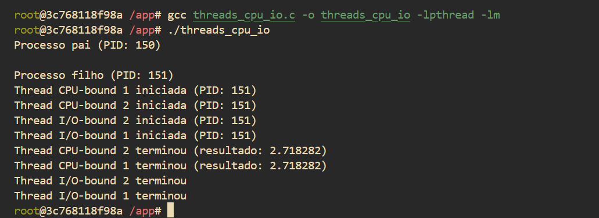

# Prática de escalonamento de tarefas

**aluno:** [Lucas Tales B. Barbosa](https://github.com/Lucas-Tales1)

**data:** 02/06/2025

## Introdução

Esta atividade tem como objetivo a prática de escalonamento de tarefas

## Relato

1. O processo principal (pai) cria um processo filho com fork().

2. O processo filho cria quatro threads:
    - Duas fazem cálculos pesados (CPU-bound).

    - Duas simulam operações de entrada/saída (I/O-bound) com sleep.

3. Cada thread imprime quando começa e quando termina.

4. O processo pai espera o filho terminar com wait().

 

1. pgrep threads_cpu_io busca o(s) PID(s) do processo threads_cpu_io em execução.

2. O resultado desse comando é passado para o parâmetro -p do top, que indica para o top monitorar especificamente esses processos.

3. A opção -H faz com que o top mostre as threads individuais desses processos, não apenas o processo principal.

4. Com isso, é possível visualizar em tempo real o uso de CPU de cada thread criada pelo programa, incluindo as threads CPU-bound (cálculos intensivos) e as threads I/O-bound (espera simulada).

5. Essa visualização permite observar a distribuição do uso do processador pelas threads, facilitando a análise de escalonamento e comportamento do sistema operacional.

 

1. watch -n 1 "ps -eLf | grep threads_processos"

2. watch -n 1: executa o comando especificado a cada 1 segundo, atualizando a tela automaticamente.

    "ps -eLf":

    ps: comando que lista os processos em execução.

    -e: mostra todos os processos.

    -L: mostra também as threads dos processos.

    -f: exibe a saída em formato completo (mais informações).

    grep threads_cpu_io: filtra a saída do ps para exibir somente as linhas relacionadas ao programa.

3. Esse comando permite monitorar quantas threads estão ativas, qual o PID e TID de cada uma, e se elas estão executando ou dormindo. É útil para confirmar se todas as threads (CPU-bound e I/O-bound) foram realmente criadas e estão sendo gerenciadas pelo sistema operacional.

 

1. O programa cria um processo filho, que por sua vez cria quatro threads: duas CPU-bound (com cálculo intensivo) e duas I/O-bound (simulando espera com sleep).

2. As mensagens indicam que todas as threads foram iniciadas e terminaram conforme esperado.

3. O tempo total de execução (tempo "real") foi de aproximadamente 2.01 segundos, o que corresponde ao tempo necessário para completar tanto as operações intensivas de CPU quanto as de I/O simuladas.

4. O tempo de CPU usuário (usr time) mostra que o processo gastou cerca de 170 ms em processamento direto (cálculos).

5. O tempo de CPU do sistema (sys time) foi muito baixo, aproximadamente 9 ms, indicando pouca sobrecarga do sistema operacional.

6. A diferença entre o tempo total e o tempo de CPU indica que o programa ficou esperando em operações I/O (simuladas pelo sleep), o que explica a maior duração real da execução.

 

1. task-clock: tempo total em que o processo esteve em execução. Aqui, 181ms de CPU foram efetivamente usados.

2. CPUs utilized: indica que, em média, o programa utilizou apenas 9% de um núcleo de CPU.

3. page-faults: foram 145 falhas de página representa acesso à memória virtual.

4. user e sys: o tempo gasto em modo usuário foi de ~147ms e em modo kernel ~25ms. A soma fica em ~172ms.

## Conclusão

A realização desta atividade permitiu a aplicação prática dos conceitos de escalonamento de tarefas, com foco na diferença entre threads CPU-bound e I/O-bound. Ao implementar e monitorar o comportamento dessas threads, compreendi como o sistema operacional gerencia o uso do processador de acordo com o tipo de tarefa executada.

Aprendi a utilizar ferramentas de monitoramento como htop, top, ps, watch e também o comando time, que me permitiram visualizar, em tempo real, o uso da CPU por cada thread e medir o desempenho do programa.

Além disso, ganhei familiaridade com o uso de Docker para configurar ambientes isolados, com o terminal fish e com a execução de programas em containers Linux.

